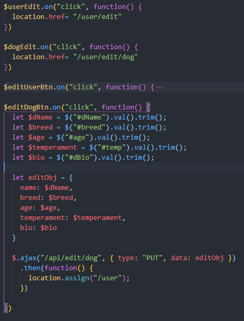
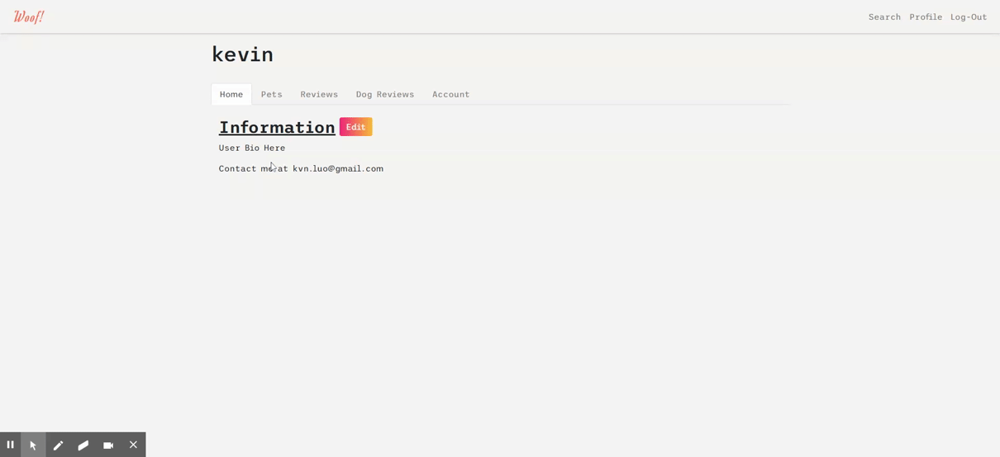
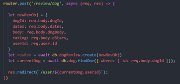
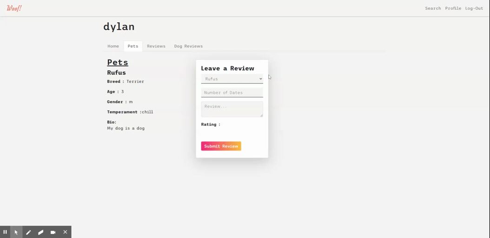
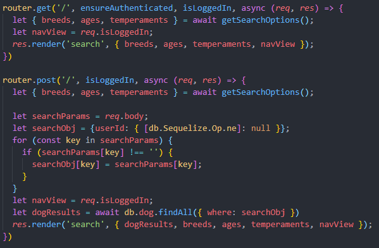

# Woof
[](https://opensource.org/licenses/MIT)


An app for dogs and owners to meet nearby dogs and owners for a playdate. 

## Table of Contents
  - [Technologies:](#technologies)
  - [Work Flow:](#work-flow)
  - [Code & Usage](#code--usage)
  - [License](#license)
  - [Contributing](#contributing)
  - [Questions](#questions)

## Technologies:

```
- HTML5                    - Nodes.js            
- CSS3                     - Sequelize
- Bootstap 4               - Passport
- Responsive Design(RWD)   - Express
- Javascript               - Connect-Flash
- Jquery                   - Dot-Env
- Mysql                    - Heroku
- Bcrypt                   - Handlebars.js
```

## Work Flow:

[Deployed Link](https://woof-23.herokuapp.com/)

We started the project by divvying up tasks based on front end and back end work. Brian Lee handled the model creation while the rest of us began creating the structure of the site pages (eg homepage, profile page, search, etc). Then we broke tasks up based on the necessary routes. Gabe and Brian Lee worked on the user profile edit and reviews and Brian Barello worked on the search routes. Towards the end of the project we worked a lot more as a group to integrate all of our work that'd we'd done individually.

## Code & Usage

**Editing User Profiles**

One set of routes was dedicated to editing a user's profile. The process began with the edit button on the logged in user's profile page which redirects you to the edit profile page. The edit profile page is prepopulated with the user's database information and when the user submits the edit profile form a put request is sent to an api route which updates our database. 





**Posting Reviews**

Posting reviews was a little more difficult since we had to add values for who was posting the review and who was receiving the review. When a user posts a new review, a review instance is created and you get redirected back to the user profile you were on. The user profile route queries for all reviews related to this profile so your posted review will show up





**Search**

We decided to have dropdown options dynamically populate the search parameters. This was done by querying attributes from registered users when the search page is requested.If the user didn't want to specify a search parameter then the search post route would find all dogs in the database. 




## License
Licensed under the [MIT](https://opensource.org/licenses/MIT) License.

## Contributing
If you'd like to contribute, make a clone of the repository on your local machine and make a pull request with any changes you made.

## Questions
* [kvn.luo@gmail.com](kvn.luo@gmail.com)
* [bryanbarello@gmail.com](bryanbarello@gmail.com)
